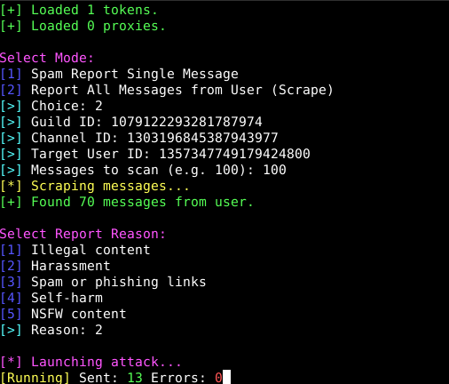

# Daily Reporter - Discord Audit Tool


**Daily Reporter** is an advanced, lightweight Discord reporting tool designed for educational and testing purposes. It features a sleek, colorful CLI, automatic ID extraction from URLs, and multi-threaded reporting capabilities.

**Created by GH0ST**

---

## ⚠️ Disclaimer / Zrzeczenie się odpowiedzialności

**English:**
This tool is for **educational purposes only**. Mass reporting can lead to a violation of Discord's Terms of Service and may result in a ban of your account. The creator (GH0ST) is not responsible for any misuse of this tool. Use it at your own risk.

**Polski:**
To narzędzie służy **wyłącznie do celów edukacyjnych**. Masowe zgłaszanie wiadomości może naruszać Warunki Korzystania z Usług Discord i prowadzić do blokady konta. Twórca (GH0ST) nie ponosi odpowiedzialności za niewłaściwe użycie tego narzędzia. Używasz go na własne ryzyko.

---

# 🇬🇧 English Documentation

### Features
*   **Cross-Platform:** Works seamlessly on Windows, Linux, and Android (Termux).
*   **Smart Input:** Automatically extracts Channel/Message IDs from pasted URLs.
*   **Colorful CLI:** Professional and easy-to-read interface.
*   **Optimized Speed:** Configured to avoid immediate rate limits (Error 429).
*   **User Scraping:** Automatically fetch and report up to 10000+ messages from a target user using smart pagination. Scan single channel or all server channels.
*   **Keyword Filtering:** Filter scraped messages by specific words or phrases to target only relevant content.
*   **Guild Reporting:** Mass-report server owners by automatically detecting and reporting the guild owner's profile.
*   **Multi-Token Support:** Rotate through multiple accounts for maximum efficiency.
*   **Proxy Support:** Integrated HTTP/HTTPS proxy rotation to prevent IP bans.
*   **Logging:** Detailed logging of success and errors to `logs.txt`.



### ⚙️ Configuration

1.  **Tokens (`tokens.txt`)**:
    Create a file named `tokens.txt` in the bot folder. Add your Discord tokens, one per line.
    ```text
    OTkw...
    MTIz...
    ```
    *If `tokens.txt` is missing, the bot will ask for a single token.*

2.  **Proxies (`proxies.txt`)**:
    Create a file named `proxies.txt`. Add proxies (http/https), one per line.
    ```text
    http://user:pass@ip:port
    ip:port
    ```


### 📥 Installation & Usage

#### 📱 Termux (Android)
1.  Update packages and install dependencies:
    ```bash
    pkg update && pkg upgrade -y
    pkg install python git -y
    ```
2.  Clone the repository:
    ```bash
    git clone https://github.com/hoki0/Discord-mass-report.git
    cd daily-reporter
    ```
    *(Note: If you are using a local folder, simply `cd` into it)*
3.  Install Python requirements:
    ```bash
    python setup.py
    ```
4.  Run the bot:
    ```bash
    python main.py
    ```

#### 💻 Windows
1.  **Install Python:** Download and install Python 3.x from [python.org](https://www.python.org/). **Make sure to check "Add Python to PATH" during installation.**
2.  **Download Source:** Download the `.zip` file of this repository and extract it, or use Git:
    ```cmd
    git clone https://github.com/hoki0/Discord-mass-report.git
    cd daily-reporter
    ```
3.  **Install Requirements:**
    Open `cmd` or PowerShell in the bot folder and run:
    ```cmd
    python setup.py
    ```
4.  **Run:**
    ```cmd
    python main.py
    ```

#### 🐧 Linux / 🍎 macOS
1.  **Install Python:** Ensure you have Python 3 installed.
    *   Linux (Debian/Ubuntu): `sudo apt install python3 git -y`
    *   macOS (using Brew): `brew install python git`
2.  **Clone Repository:**
    ```bash
    git clone https://github.com/hoki0/Discord-mass-report.git
    cd daily-reporter
    ```
3.  **Install Dependencies:**
    ```bash
    python3 setup.py
    ```
4.  **Run:**
    ```bash
    python3 main.py
    ```

---

# 🇵🇱 Polska Dokumentacja

### Funkcje
*   **Wieloplatformowość:** Działa na Windows, Linux i Androidzie (Termux).
*   **Inteligentne wprowadzanie:** Automatycznie wyciąga ID kanału/wiadomości z wklejonych linków.
*   **Kolorowe CLI:** Profesjonalny i czytelny interfejs terminala.
*   **Zoptymalizowana prędkość:** Skonfigurowany tak, aby unikać szybkich blokad (Rate Limit / Error 429).
*   **Scrapowanie Użytkownika:** Automatycznie pobiera i zgłasza do 1000+ wiadomości wybranego użytkownika dzięki inteligentnej paginacji.
*   **Filtrowanie Słów Kluczowych:** Filtruj pobrane wiadomości według określonych słów lub fraz, aby zgłaszać tylko istotne treści.
*   **Zgłaszanie Serwerów:** Masowe zgłaszanie właścicieli serwerów poprzez automatyczne wykrywanie i zgłaszanie profilu właściciela gildii.
*   **Obsługa Wielu Tokenów:** Rotacja wieloma kontami dla maksymalnej efektywności.
*   **Obsługa Proxy:** Zintegrowana rotacja proxy HTTP/HTTPS, aby zapobiec blokadom IP.
*   **Logowanie:** Szczegółowe zapisywanie sukcesów i błędów do pliku `logs.txt`.

### ⚙️ Konfiguracja

1.  **Tokeny (`tokens.txt`)**:
    Stwórz plik o nazwie `tokens.txt` w folderze bota. Wklej swoje tokeny Discord, jeden pod drugim.
    ```text
    OTkw...
    MTIz...
    ```
    *Jeśli plik `tokens.txt` nie istnieje, bot poprosi o pojedynczy token.*

2.  **Proxy (`proxies.txt`)**:
    Stwórz plik o nazwie `proxies.txt`. Dodaj proxy (http/https), jedno pod drugim.
    ```text
    http://user:pass@ip:port
    ip:port
    ```

### 📥 Instalacja i Użycie

#### 📱 Termux (Android)
1.  Zaktualizuj pakiety i zainstaluj zależności:
    ```bash
    pkg update && pkg upgrade -y
    pkg install python git -y
    ```
2.  Pobierz repozytorium:
    ```bash
    git clone https://github.com/hoki0/Discord-mass-report.git
    cd daily-reporter
    ```
    *(Uwaga: Jeśli używasz lokalnego folderu, po prostu wejdź do niego komendą `cd`)*
3.  Zainstaluj wymagane biblioteki:
    ```bash
    python setup.py
    ```
4.  Uruchom bota:
    ```bash
    python main.py
    ```

#### 💻 Windows
1.  **Zainstaluj Python:** Pobierz i zainstaluj Python 3.x ze strony [python.org](https://www.python.org/). **Pamiętaj, aby zaznaczyć opcję "Add Python to PATH" podczas instalacji.**
2.  **Pobierz kod:** Ściągnij plik `.zip` z tym repozytorium i rozpakuj go, lub użyj Git:
    ```cmd
    git clone https://github.com/hoki0/Discord-mass-report.git
    cd daily-reporter
    ```
3.  **Zainstaluj biblioteki:**
    Otwórz `cmd` lub PowerShell w folderze z botem i wpisz:
    ```cmd
    python setup.py
    ```
4.  **Uruchom:**
    ```cmd
    python main.py
    ```

#### 🐧 Linux / 🍎 macOS
1.  **Zainstaluj Python:** Upewnij się, że masz zainstalowanego Pythona 3.
    *   Linux (Debian/Ubuntu): `sudo apt install python3 git -y`
    *   macOS (przez Brew): `brew install python git`
2.  **Pobierz repozytorium:**
    ```bash
    git clone https://github.com/hoki0/Discord-mass-report.git
    cd daily-reporter
    ```
3.  **Zainstaluj zależności:**
    ```bash
    python3 setup.py
    ```
4.  **Uruchom:**
    ```bash
    python3 main.py
    ```

---
© 2024 **GH0ST**. All rights reserved.
